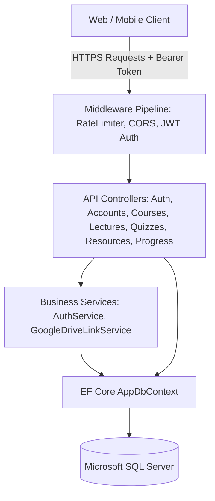
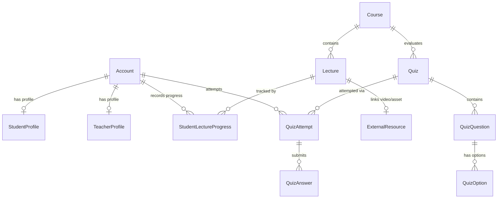

# 🎓 Code Class Platform — Back-End API

[](https://dotnet.microsoft.com/)
[](https://docs.microsoft.com/dotnet/csharp/)
[](https://learn.microsoft.com/ef/core/)
[](https://www.microsoft.com/sql-server)
[](https://jwt.io/)
[-85EA2D?style=flat&logo=swagger&logoColor=black)](http://localhost:5039/swagger)

A high-performance, enterprise-ready ASP.NET Core Web API powering the **Code Class Platform** — an educational management ecosystem supporting multi-role access (Students, Teachers, and Administrators), structured course delivery, interactive quizzes, video playback analytics, and external Google Drive resource cataloging.

---

## 📑 Table of Contents

- [Architectural Highlights](#-architectural-highlights)
- [Technology Stack](#-technology-stack)
- [System Architecture & Data Model](#-system-architecture--data-model)
- [External Resource Model (Google Drive)](#-external-resource-model-google-drive)
- [Database Configuration & Migrations](#-database-configuration--migrations)
- [Security & Authentication](#-security--authentication)
- [API Overview & Documentation](#-api-overview--documentation)
- [Quickstart & Local Setup](#-quickstart--local-setup)
- [Seeded Demo Accounts](#-seeded-demo-accounts)
- [Automated Testing](#-automated-testing)
- [Repository Structure](#-repository-structure)

---

## ⚡ Architectural Highlights

- **Clean RESTful API Design**: Clear controller separation with unified envelopes (`ApiResponse<T>` and `PagedResult<T>`).
- **Role-Based Access Control (RBAC)**: Fine-grained declarative authorization using JWT policies (`AdminPolicy`, `TeacherPolicy`, `StudentPolicy`).
- **Zero Heavy-Media Storage Overhead**: Replaced local/cloud object storage with an external Google Drive ingestion engine that validates, canonicalizes, and verifies links without bandwidth or storage costs on the API server.
- **Enterprise Security**: Industry-standard BCrypt password hashing, fixed-window rate limiting on authentication routes (5 requests / 15 minutes per IP), and cycle-safe JSON serialization.
- **Interactive Swagger UI**: Tailored with dark mode theming, XML code documentation, and built-in Bearer Token authorization headers.
- **Automatic Migration & Seeding**: Self-healing startup pipeline that runs pending EF Core migrations and seeds essential accounts on first launch.

---

## 💻 Technology Stack

| Layer | Technology | Purpose |
| :--- | :--- | :--- |
| **Runtime & Framework** | .NET 10 / ASP.NET Core | High-throughput asynchronous Web API |
| **Language** | C# 13 | Modern nullable-enabled C# syntax |
| **Data Access & ORM** | Entity Framework Core 10 | Code-first migrations, relational mapping, Linq |
| **Database Engine** | Microsoft SQL Server | Relational persistence with foreign keys, cascading indices |
| **Auth & Identity** | `System.IdentityModel.Tokens.Jwt` | Signed stateless authentication tokens |
| **Password Cryptography** | `BCrypt.Net-Next` | Secure salted one-way credential hashing |
| **Rate Limiting** | `Microsoft.AspNetCore.RateLimiting` | IP-partitioned brute force mitigation |
| **API Documentation** | `Swashbuckle.AspNetCore` | OpenAPI specification generation & customized Swagger UI |
| **Unit Testing** | `xUnit`, `Moq`, `Microsoft.NET.Test.Sdk` | Automated unit and integration test suite |

---

## 📐 System Architecture & Data Model

The application follows a clean layered pattern:



### Entity Relationships



---

## 📁 External Resource Model (Google Drive)

The platform avoids direct binary file uploads to preserve server storage and bandwidth. All course attachments, video lectures, and PDF materials leverage external **Google Drive** links.

### Processing Pipeline:
1. **Host Validation**: Validates HTTPS links strictly from `drive.google.com` or `docs.google.com`.
2. **File ID Extraction**: Uses compiled RegEx patterns to capture file identifiers across various Google Drive URL formats (`/file/d/{id}`, `/open?id={id}`, `/document/d/{id}`).
3. **Canonical Normalization**: Standardizes links into uniform preview URLs (e.g. `https://drive.google.com/file/d/{fileId}/view`).
4. **Media Classification**: Identifies file types (`File`, `Document`, `Presentation`, `Image`) for optimal client rendering.
5. **Verification Workflow**: Offers an endpoint (`POST /api/resources/{id}/verify`) to validate link integrity.

---

## 🗄️ Database Configuration & Migrations

The project is configured to communicate with the managed SQL Server instance:

```json
"ConnectionStrings": {
  "DefaultConnection": "Server=db67474.public.databaseasp.net; Database=db67474; User Id=db67474; Password=9c+CjM8#%oF7; Encrypt=False; MultipleActiveResultSets=True;"
}
```

### Applying Migrations via CLI

To synchronize the database schema with latest model snapshots:

```bash
# Navigate to the backend directory
cd CodeClassPlatform.BackEnd

# Update database to latest migration
dotnet ef database update

# To create a new migration after entity changes
dotnet ef migrations add <MigrationName>
```

> **Note**: `Program.cs` also runs `db.Database.Migrate()` automatically upon application startup.

---

## 🔒 Security & Authentication

- **JWT Tokens**: Signed with HMAC-SHA256 containing `accountId`, `email`, and `role` claims with configurable lifetime and 2-minute clock skew tolerance.
- **Password Hashes**: Uses BCrypt with automatic salt generation; plain passwords never hit storage.
- **Login Rate Limiter**: Maximum 5 attempts per 15-minute window partitioned by client IP.
- **CORS Support**: Configured to permit cross-origin requests from web front-ends and mobile client applications.

---

## 📖 API Overview & Documentation

For exhaustive endpoint specifications, request payloads, response schemas, and cURL snippets, refer to the complete guide:

👉 **[View Full API Reference & Usage Guide](API_GUIDE.md)**

### Endpoint Summary

| Controller | Route | Methods | Description |
| :--- | :--- | :--- | :--- |
| **Auth** | `/api/auth` | `POST`, `GET` | User login, logout, password change, current user identity (`/me`) |
| **Accounts** | `/api/accounts` | `GET`, `POST` | User account pagination, student onboarding, teacher onboarding |
| **Admin** | `/api/admin` | `GET` | Administrative aggregate dashboard metrics |
| **Courses** | `/api/courses` | `GET`, `POST`, `PUT` | Course catalog, publishing lifecycle, and multilingual titles |
| **Lectures** | `/api/lectures` | `GET`, `POST`, `PUT`, `DELETE` | Lecture ordering, duration, preview rights, and publishing |
| **Quizzes** | `/api/quizzes` | `GET`, `POST` | Assessment creation, question banks, and student attempt engine |
| **Resources** | `/api/resources` | `GET`, `POST`, `PUT`, `DELETE` | Google Drive link validation, storage, and status verification |
| **Student Progress**| `/api/studentprogress` | `GET`, `POST` | Video watch time, playback position, and completion tracking |

---

## 🚀 Quickstart & Local Setup

### 1. Prerequisites
- [.NET 10.0 SDK](https://dotnet.microsoft.com/download/dotnet/10.0) or later
- [EF Core CLI Tools](https://learn.microsoft.com/ef/core/cli/dotnet): `dotnet tool install --global dotnet-ef`

### 2. Installation & Run
```bash
# Clone the repository
git clone https://github.com/hatem247/Code-Class-Platform-Back-End.git
cd "Code Class Platform Back-End"

# Restore dependencies
dotnet restore

# Run EF database migration (ensures remote DB schema is up to date)
dotnet ef database update --project CodeClassPlatform.BackEnd

# Run the backend service
dotnet run --project CodeClassPlatform.BackEnd
```

The server will launch at:
- **API Base**: `http://localhost:5039`
- **Swagger UI**: `http://localhost:5039/swagger`

---

## 🔑 Seeded Demo Accounts

The application automatically seeds three default role accounts upon first startup:

| Role | Email | Password | Permissions |
| :--- | :--- | :--- | :--- |
| 🛡️ **Admin** | `admin@codeclass.local` | `Admin123!` | Full system administration, account creation, metrics |
| 👨‍🏫 **Teacher** | `teacher@codeclass.local` | `Teacher123!` | Create courses, lectures, quizzes, and resources |
| 🎓 **Student** | `student@codeclass.local` | `Student123!` | View courses, take quizzes, track playback progress |

---

## 🧪 Automated Testing

The solution includes an automated test suite located in `CodeClassPlatform.BackEnd.Tests`:

```bash
# Run all automated tests
dotnet test CodeClassPlatform.BackEnd.Tests/CodeClassPlatform.BackEnd.Tests.csproj
```

### Coverage includes:
- JWT token issuance & claim verification
- BCrypt password validation & mismatch handling
- User registration conflicts & duplicate protection
- Google Drive URL parsing, edge-case normalization, and malicious link rejection

---

## 📂 Repository Structure

```text
Code Class Platform Back-End/
├── API_GUIDE.md                           # Exhaustive API documentation with all payloads & curl examples
├── README.md                              # Main project documentation
├── CodeClassPlatform.BackEnd/             # ASP.NET Core Web API project
│   ├── Controllers/                       # REST API controllers
│   │   ├── AccountsController.cs
│   │   ├── AdminController.cs
│   │   ├── AuthController.cs
│   │   ├── CoursesController.cs
│   │   ├── LecturesController.cs
│   │   ├── QuizzesController.cs
│   │   ├── StorageController.cs          # (ResourcesController - /api/resources)
│   │   ├── StudentProgressController.cs
│   │   └── UploadsController.cs
│   ├── Data/                              # EF Core DbContext & Data Seeding
│   │   ├── AppDbContext.cs
│   │   └── SeedData.cs
│   ├── Entities/                          # Domain entities
│   │   ├── Account.cs
│   │   ├── Course.cs
│   │   ├── ExternalResource.cs
│   │   ├── Lecture.cs
│   │   ├── Quiz.cs
│   │   ├── StudentProfile.cs
│   │   ├── TeacherProfile.cs
│   │   └── ...
│   ├── Migrations/                        # EF Core migration history
│   ├── Models/                            # DTOs, API envelopes & request/response contracts
│   ├── Services/                          # Core business services
│   │   ├── AuthService.cs
│   │   └── GoogleDriveLinkService.cs
│   ├── Program.cs                         # Application entrypoint, DI, and middleware
│   ├── appsettings.json                   # Production configuration & connection strings
│   └── appsettings.Development.json       # Development configuration
└── CodeClassPlatform.BackEnd.Tests/       # Unit and integration test suite
    ├── AuthServiceTests.cs
    └── StorageProviderTests.cs
```

---

## 🤝 Best Practices & Contributing

1. **Commit Messages**: Follow standard conventional commits (`feat:`, `fix:`, `refactor:`, `docs:`).
2. **Migrations**: Never edit existing migrations that have already been applied to production. Always generate a new migration with `dotnet ef migrations add`.
3. **Environment Security**: Keep production secrets, connection strings, and JWT keys protected in environment variables or Azure Key Vault / AWS Secrets Manager in deployed environments.

---

*Built for the Code Class Platform educational ecosystem.*
